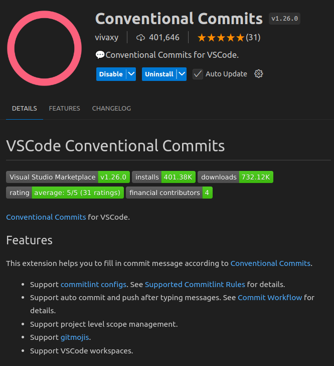

# Committing

## ⚠️ Warning

Just a reminder to **NEVER** commit any sensitive information to the repository. This includes API keys, passwords, and other credentials. If you accidentally commit sensitive information, please inform the team **immediately** so that we can take the necessary steps to secure the repository.

## 🛠️ Tools

Please use the [Conventional Commits](https://marketplace.visualstudio.com/items?itemName=vivaxy.vscode-conventional-commits) extension for VS Code to make it easy for you to make consistently standardized commits:




## 🏫 Useful Tips

### ✏️ Ammending Commits

If you need to amend a commit message from the latest commit, you can use the following command:

```bash
git commit --amend
```

Here is a useful resource for amending commits: [Git Amend Tutorial: Rewrite Git History](https://www.youtube.com/watch?v=q53umU5vMkk&list=PLfU9XN7w4tFwKwh_xPSQ_X1-hROQEpHnM&index=14)

### 💦 Squashing Commits

If you need to squash multiple commits into one, you can use the following command:

```bash
git rebase -i HEAD~<number_of_commits>
```

Alternatively, use `git log` to find the commit hash of the last commit you want to squash and use the following command:

```bash
git rebase -i <commit_hash>
```

This will open an interactive rebase window where you can squash commits.

For more information on squashing using interactive rebase, this is a useful video: [Learn Git Squash in 3 minutes](https://www.youtube.com/watch?v=V5KrD7CmO4o&list=PLfU9XN7w4tFwKwh_xPSQ_X1-hROQEpHnM&index=18).


### 😎 Keeping the feature branch up-to-date

We use a `git rebase` strategy to keep the feature branch up-to-date with the `dev` branch. This ensures that the feature branch is always based on the latest changes in the `dev` branch.

First check that the `dev` branch is up-to-date:

```bash
git checkout dev
git pull
```

If nothing has changed, you can switch back to your feature branch and continue working as usual. However, if there have been changes in the meantime, you will need to rebase your feature branch on the updated `dev` branch:

```bash
git checkout <feature_branch>
git rebase dev
```

Note that this may cause conflicts that you will need to resolve. If you are unsure how to resolve conflicts, please refer to the [Resolve Git MERGE CONFLICTS: The Definitive Guide](https://www.youtube.com/watch?v=Sqsz1-o7nXk) video. Yes, it says "merge conflicts," but the same principles apply to rebasing.


#### ⚠️ I don't know what I'm doing and I don't know how to exit the rebase!

If you find yourself in the middle of a rebase and you don't know what you're doing, you can exit the rebase by running the following command:

```bash
git rebase --abort
```

This will take you back to the state before you started the rebase. You can then try again or ask for help.

#### ⚠️ I can't push my changes to remote after rebasing!

Yes, this is the single major downside of rebasing if you have already pushed some of your local feature branch commits to the remote feature branch. You will need to force push your changes to the remote feature branch:

```bash
git push origin <feature_branch> --force
```

Force pushing is normally taboo in all other cases, but because of the [Ground Rules: One person per branch](./branches.md#ground-rules), there is no risk of inadvertently overwriting someone else's work.